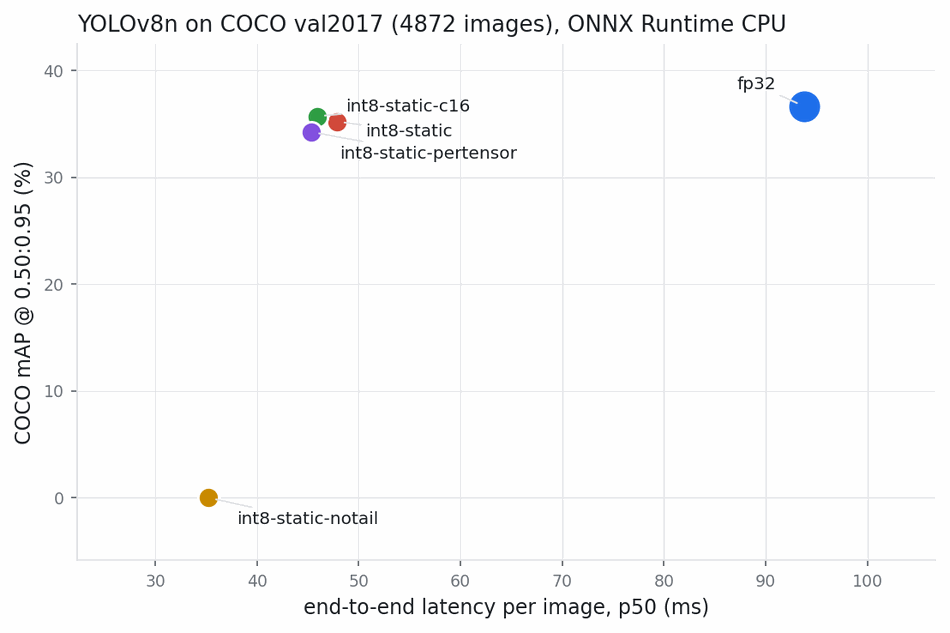
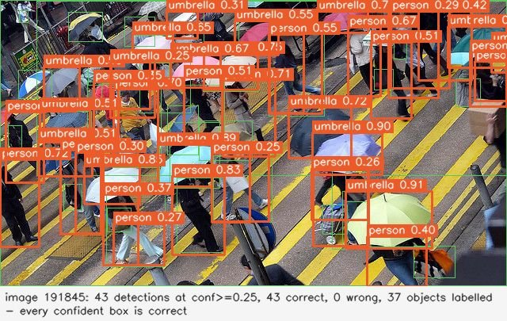
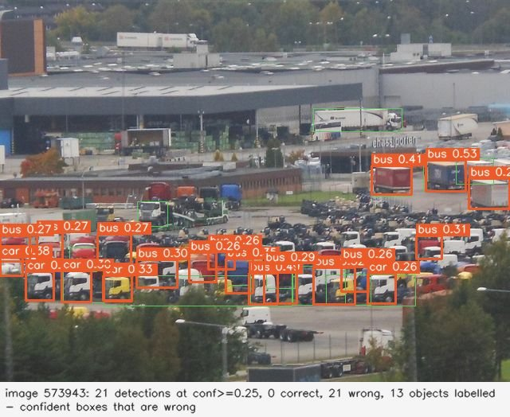
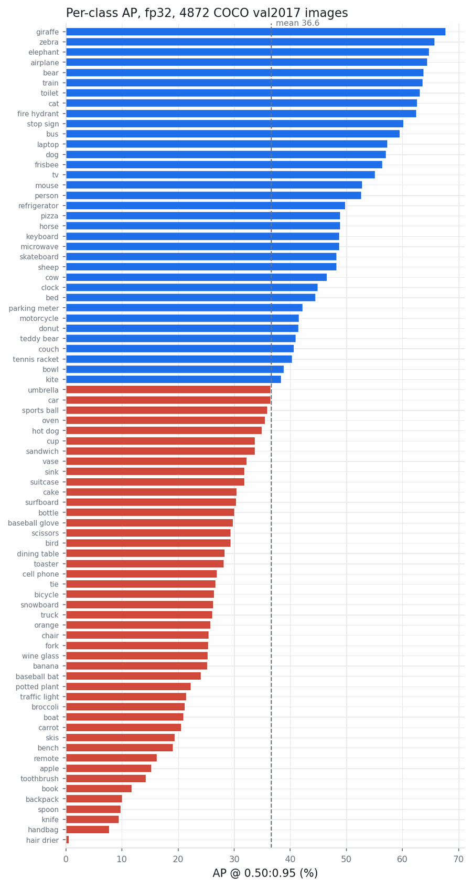
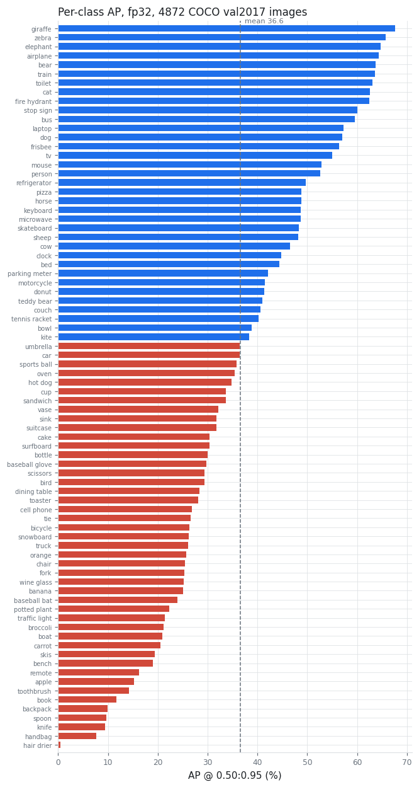
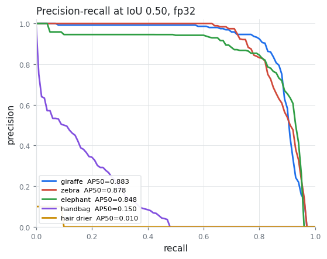
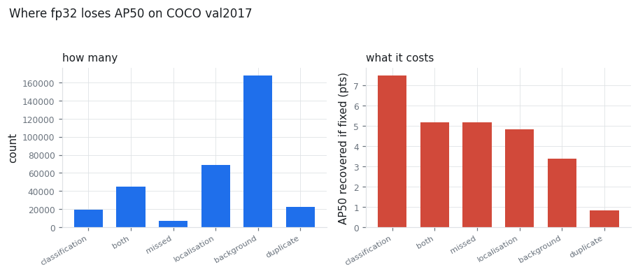
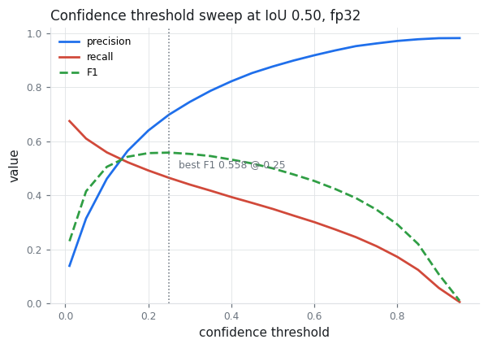
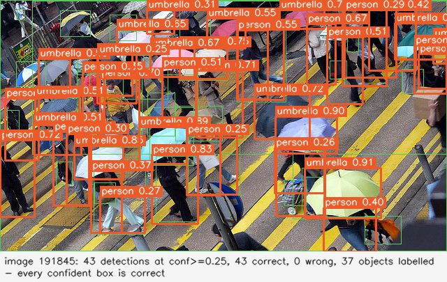

# object-detection-benchmark

Measure what an object detector actually costs you: real COCO mAP computed from
scratch, post-training INT8 quantisation, and the accuracy-versus-latency table
that falls out of running both over 4,872 real images.


## Screenshots


Accuracy against latency for seven YOLOv8n variants, measured on 4,872 real COCO val2017 images on the same CPU. Marker area is the model file size.


COCO val2017 image 191845: 43 confident detections, all 43 matched to a labelled object.


The failure the average hides. COCO val2017 image 573943: 21 confident detections, none of them correct.


Per-class AP across all 80 COCO classes, spanning 0.5 to 67.7 around a mean of 36.6 - the spread a single mAP number hides.

Every number and every image in this README was produced by the code in this
repository, on real COCO val2017 images with a real YOLOv8n ONNX model. Nothing
is copied from a paper.

## The problem

Everyone quotes mAP. Almost nobody can tell you what it cost them.

You pick a detector because a table said 37.3. Then you put it on a CPU and it
runs at 10 FPS, so you quantise it, and now you have a model that is 2.3x
faster and you have no idea what it gave up. Or worse: it returns nothing at
all, at any threshold, and the graph looks perfectly healthy.

Meanwhile the single mAP number hides the thing that will actually bite you. It
is an average over eighty classes whose individual APs here span 0.5 to 67.7.
If the class you care about sits in the bottom decile, the average is telling
you nothing useful.

This repository answers three questions with measurements rather than folklore:

1. **What is my model's real accuracy, and is the number trustworthy?** The
   COCO metric is implemented here from the protocol, not wrapped from a
   library, and it matches `pycocotools` bit for bit on 367,010 real
   detections.
2. **What does quantisation actually buy and cost?** Seven variants, one
   accuracy-versus-latency table, measured on the same images on the same CPU.
3. **Where does the model fail?** Per-class AP, a TIDE-style error
   decomposition that says how much AP each error type is worth, the class
   confusions behind it, and the precision/recall curve you get from moving the
   confidence threshold.

## What it does

* **Implements COCO mAP from the protocol.** IoU sweep 0.50:0.05:0.95,
  101-point interpolated precision-recall, per-class AP then mean, the three
  area bands, maxDets 1/10/100, crowd regions scored by
  intersection-over-detection-area, and greedy matching in descending score
  order. No `pycocotools` in the library path.
* **Proves the metric is right.** All twelve COCO numbers are asserted equal to
  `pycocotools` on random detection sets, on crowd-only and dense edge cases,
  and on real detections from the real model on real COCO images.
* **Runs a real ONNX model end to end.** Letterbox with the correct padding and
  its exact inverse, YOLO head decode, class-aware NMS, un-letterboxing back to
  original image coordinates, and a mock backend that exercises the same code
  path with no weights so the whole test suite runs offline.
* **Quantises and measures.** Dynamic INT8, static INT8 calibrated on a
  disjoint split of val2017, per-channel versus per-tensor weights, two
  calibration set sizes, and the naive whole-graph recipe that produces a fast
  model detecting nothing.
* **Times every stage separately.** Preprocess, inference, NMS and
  postprocess, reported as p50/p90/p99 with a jitter ratio, because the mean
  hides the frame-time spikes that cause visible stutter.
* **Decomposes the failures.** Per-class AP ranked best to worst, an error
  taxonomy that says how much AP each error type is worth, the class confusions
  behind the classification errors, and the operating curve from sweeping the
  confidence threshold.
* **Caches the expensive part.** A run is keyed by a content hash of the model
  file, the input size, the thresholds and the exact image list. Change nothing
  and a re-run is a JSON load instead of 4,872 forward passes - re-scoring the
  full split takes 34 seconds.

## Quickstart

One command. No downloads, no model weights, no hardware:

```bash
git clone https://github.com/Pratyush150/object-detection-benchmark
cd object-detection-benchmark
pip install numpy
./tools/detbench --demo
```

That generates a small synthetic dataset, runs the full pipeline over it -
letterbox, head decode, class-aware NMS, un-letterbox - scores it with the
from-scratch COCO metric, decomposes the errors, sweeps the confidence
threshold and prints per-stage latency percentiles, in about two seconds. The
numbers describe generated shapes and the tool says so on line two; they exist
to show every stage working without a gigabyte of downloads.

To reproduce the real measurements you need COCO val2017 and the model:

```bash
pip install -r requirements.txt
pip install ultralytics                      # only for the ONNX export
python3 tools/fetch_assets.py --dest assets  # ~1 GB, SHA-256 checked

./tools/detbench evaluate \
    --model assets/yolov8n.onnx \
    --annotations assets/annotations/instances_val2017.json \
    --images assets/val2017 --cache assets/cache

python3 benchmarks/run_sweep.py    --assets assets --annotations assets/annotations/instances_val2017.json --images assets/val2017
python3 benchmarks/run_latency.py  --assets assets --annotations assets/annotations/instances_val2017.json --images assets/val2017 --sweep benchmarks/results/sweep.json
python3 benchmarks/verify_metric.py --annotations assets/annotations/instances_val2017.json --detections assets/cache/fp32_<hash>.json
python3 benchmarks/make_figures.py --sweep benchmarks/results/sweep.json --cache assets/cache --latency benchmarks/results/latency.json --annotations assets/annotations/instances_val2017.json --images assets/val2017
```

Nothing `fetch_assets.py` downloads is committed: the images are 780 MB and the
weights are third-party under a different licence. Every download is checked
against a recorded SHA-256 before it is used.

## Measured results

**Setup.** YOLOv8n exported to ONNX at 640x640, opset 13, NMS outside the
graph. COCO val2017. Confidence floor 0.001, NMS IoU 0.7, at most 300 boxes
into NMS and the COCO cap of 100 out. Single-label decode. ONNX Runtime 1.23.2,
CPU execution provider, 11th Gen Intel Core i5-1135G7, 8 logical cores.

**The split.** 128 of the 5,000 val2017 images are held out as the
quantisation calibration set (`split_ids(128, seed=0)`). Every accuracy number
below is measured on the other **4,872** images, so no variant is ever scored
on an image it was calibrated on.

### Accuracy

| variant | model size | mAP | mAP50 | mAP75 | AP small | AP medium | AP large |
|---|---:|---:|---:|---:|---:|---:|---:|
| `fp32` | 12.82 MB | **36.63** | 51.48 | 39.80 | 17.40 | 40.45 | 52.01 |
| `int8-static-c16` | 3.66 MB | 35.70 | 50.44 | 38.97 | 16.99 | 39.44 | 50.35 |
| `int8-static` | 3.66 MB | 35.22 | 49.77 | 38.30 | 16.65 | 39.00 | 49.67 |
| `int8-static-pertensor` | 3.58 MB | 34.24 | 48.79 | 37.22 | 15.88 | 37.80 | 48.14 |
| `int8-static-notail` | 3.60 MB | 0.00 | 0.00 | 0.00 | 0.00 | 0.00 | 0.00 |
| `int8-dynamic` | 3.49 MB | *not runnable* | | | | | |
| `int8-static-entropy` | *not built* | *not measured* | | | | | |

`int8-static` is per-channel min/max calibration on 128 images with the decode
tail kept in float32; `-c16` is the same recipe on 16 images; `-pertensor`
drops per-channel weight scales; `-notail` quantises the whole graph including
the decode tail.

Two variants produced no accuracy number, and both non-results are worth more
than a footnote:

* **`int8-dynamic` builds but cannot be loaded.** YOLOv8n's graph is 64 `Conv`
  nodes and zero `MatMul`, so ONNX Runtime's dynamic quantiser rewrites every
  convolution to `ConvInteger`, which the CPU execution provider does not
  implement: `NOT_IMPLEMENTED : Could not find an implementation for
  ConvInteger(10) node with name '/model.0/conv/Conv_quant'`. Dynamic INT8 is a
  dead end for convolutional detectors on this runtime. It is worth trying on
  transformer-shaped models full of `MatMul`; it is not worth trying here.
* **`int8-static-entropy` was not measured.** ONNX Runtime's entropy calibrator
  holds the collected activation tensors in memory and was killed by the OOM
  killer on this 3.7 GB machine, at both 128 and 16 calibration images. It is
  left in `config/variants.json` with `enabled: false` and the reason recorded,
  rather than quietly deleted.

### Accuracy versus latency

Latency is measured in a dedicated pass (`benchmarks/run_latency.py`): the same
200 COCO images, decoded into memory first, 10 warmup iterations, 2 repeats, so
400 timed frames per variant on an otherwise idle machine.

| variant | size | mAP | Δ mAP | total p50 | total p90 | total p99 | inference p50 | inference speedup | mean FPS | p99 FPS |
|---|---:|---:|---:|---:|---:|---:|---:|---:|---:|---:|
| `fp32` | 12.82 MB | 36.63 | — | 93.8 ms | 108.5 ms | 134.0 ms | 82.4 ms | 1.00x | 10.8 | 7.5 |
| `int8-static-c16` | 3.66 MB | 35.70 | **-0.93** | 45.9 ms | 57.3 ms | 78.8 ms | 34.9 ms | 2.36x | 21.1 | 12.7 |
| `int8-static` | 3.66 MB | 35.22 | -1.41 | 47.8 ms | 62.2 ms | 110.4 ms | 35.8 ms | 2.30x | 19.4 | 9.1 |
| `int8-static-pertensor` | 3.58 MB | 34.24 | -2.39 | 45.3 ms | 57.1 ms | 70.8 ms | 34.2 ms | 2.41x | 21.4 | 14.1 |
| `int8-static-notail` | 3.60 MB | 0.00 | -36.63 | 35.2 ms | 39.2 ms | 43.1 ms | 28.3 ms | 2.91x | 28.7 | 23.2 |

What that table says, in order of how much it should change your plans:

1. **Static INT8 costs about one point of mAP and halves end-to-end latency.**
   3.5x smaller on disk, 2.3x faster inference, 1.96x faster end to end. On a
   CPU-bound deployment this is close to free.
2. **The whole-graph recipe is 2.91x faster and detects nothing.** `-notail`
   has the best latency in the table and an mAP of exactly zero. If you
   quantise a YOLO graph without excluding the decode tail, and you check the
   result by looking at throughput, you will ship this.
3. **Per-channel weight scales are worth ~1.5 points of mAP for nothing.**
   `int8-static` versus `-pertensor`: 35.22 against 34.24, at the same speed
   and 76 KB more on disk.
4. **More min/max calibration images made it slightly worse.** 16 images scored
   35.70; 128 scored 35.22. That is not a bug and it is not noise in the metric
   - both were scored on the same 4,872 images with a metric verified to the
   twelfth decimal. Min/max calibration takes the *extremes* of what it sees,
   so every extra image can only widen a range, and a single outlier activation
   coarsens the step size for every value in that tensor. More data helps
   percentile and entropy calibration; with min/max it can hurt. It is a good
   argument for treating calibration set size as something to sweep rather than
   maximise.
5. **The end-to-end speedup is smaller than the inference speedup.** 2.30x on
   inference becomes 1.96x end to end, because preprocessing (5.4 ms) and NMS
   (5.4 ms at the median) do not get faster. Amdahl's law applies to detection
   pipelines too.

### Where the time goes

| stage | fp32 mean | fp32 p50 | fp32 p90 | fp32 p99 | fp32 p99/p50 | int8 mean | int8 p50 | int8 p90 | int8 p99 | int8 p99/p50 |
|---|---:|---:|---:|---:|---:|---:|---:|---:|---:|---:|
| preprocess | 5.02 | 4.83 | 6.22 | 7.05 | 1.46 | 5.43 | 5.36 | 6.54 | 12.13 | 2.26 |
| inference | 80.78 | 82.37 | 94.05 | 100.27 | 1.22 | 37.60 | 35.76 | 42.31 | 74.68 | 2.09 |
| nms | 6.82 | 4.59 | 15.58 | 28.41 | **6.19** | 8.28 | 5.39 | 16.91 | 37.61 | **6.98** |
| postprocess | 0.10 | 0.10 | 0.14 | 0.22 | 2.33 | 0.11 | 0.11 | 0.16 | 0.21 | 1.97 |
| total | 92.72 | 93.81 | 108.48 | 134.00 | 1.43 | 51.43 | 47.82 | 62.23 | 110.44 | 2.31 |

All figures in milliseconds over 400 frames.

**Why mean FPS is the wrong number.** `fp32` averages 10.8 FPS. Its p99 frame
time is 134 ms, which is 7.5 FPS. If something downstream has a 10 Hz deadline,
the mean says you make it and the p99 says you miss it in the worst 1% of
frames - and it is exactly those frames a viewer notices as stutter. One 134 ms
frame among ninety-nine 94 ms frames moves the mean by 0.4 ms and the p99 by
forty.

The NMS row is where the jitter lives: p99/p50 of 6.19. NMS cost depends on how
many candidates survive the 0.001 confidence floor, which depends on the image.
An empty road produces a handful; the crowd scene below produces thousands.
Inference, by contrast, is almost perfectly predictable at 1.22 - the same
convolutions run on the same tensor shapes every frame. If you want a
detection pipeline with a tight frame-time budget, NMS is what you bound, not
the network.

`int8-static` shows a p99 of 110 ms against a p50 of 48 ms, driven by a single
217 ms inference outlier in 400 frames. `-c16` and `-pertensor`, built from the
same recipe, show p99s of 79 ms and 71 ms. That spread across nearly identical
models is a measurement artefact of a laptop CPU, not a property of the
quantised graph, and it is left in the table rather than smoothed away.

### Is the metric correct?

`pycocotools` is the reference implementation of the COCO metric. This
repository does not use it: `detbench/metrics/coco_map.py` implements the
protocol directly, and `pycocotools` appears only in the test suite and in
`benchmarks/verify_metric.py`, to hold that implementation honest.

Scoring the same 367,010 detections over the same 4,872 images with both:

| metric | detbench | pycocotools | abs diff |
|---|---:|---:|---:|
| AP @ 0.50:0.95, all, maxDets=100 | 0.366292468048 | 0.366292468048 | 0.0e+00 |
| AP @ 0.50, all, maxDets=100 | 0.514783906518 | 0.514783906518 | 0.0e+00 |
| AP @ 0.75, all, maxDets=100 | 0.398023047115 | 0.398023047115 | 0.0e+00 |
| AP @ 0.50:0.95, small, maxDets=100 | 0.173954129172 | 0.173954129172 | 0.0e+00 |
| AP @ 0.50:0.95, medium, maxDets=100 | 0.404532620277 | 0.404532620277 | 0.0e+00 |
| AP @ 0.50:0.95, large, maxDets=100 | 0.520095107021 | 0.520095107021 | 0.0e+00 |
| AR @ 0.50:0.95, all, maxDets=1 | 0.303619498914 | 0.303619498914 | 0.0e+00 |
| AR @ 0.50:0.95, all, maxDets=10 | 0.493089837060 | 0.493089837060 | 0.0e+00 |
| AR @ 0.50:0.95, all, maxDets=100 | 0.531297782877 | 0.531297782877 | 0.0e+00 |
| AR @ 0.50:0.95, small, maxDets=100 | 0.289230886977 | 0.289230886977 | 0.0e+00 |
| AR @ 0.50:0.95, medium, maxDets=100 | 0.592759654029 | 0.592759654029 | 0.0e+00 |
| AR @ 0.50:0.95, large, maxDets=100 | 0.706709325495 | 0.706709325495 | 0.0e+00 |

Largest absolute difference across all twelve: **0.0e+00**. Identical to every
digit double precision has, including the crowd-region handling and the
area-band edge cases. The from-scratch implementation also finishes the split
in 32.5 s against the reference's 49.5 s.

The same comparison runs as a test on random detection sets with crowd regions
(`tests/test_metrics_vs_pycocotools.py`), and, when the assets are present, on
real model output over real images.

### Why 36.63 and not the published 37.3

Ultralytics publishes 37.3 mAP for YOLOv8n on COCO val2017. This repository
measures **36.63** on 4,872 images, and **36.57** on all 5,000 with the same
settings. The gap is about 0.7 points and it is not a disagreement about the
metric - the metric is verified above to twelve decimal places on these exact
detections. It is a difference in the inference recipe, and every part of it is
a flag here:

* **Single-label decode.** Each anchor emits only its highest-scoring class.
  Ultralytics' validation path uses multi-label NMS, where one anchor can emit
  several classes above threshold. Multi-label costs latency and gains a few
  tenths of a point; `--multi-label` turns it on.
* **NMS settings.** IoU 0.7, up to 300 boxes into NMS. These are tuned per
  release upstream, and moving the NMS IoU by 0.05 is worth a measurable
  fraction of a point.
* **Letterbox details.** Padding colour, whether images are allowed to scale
  up, and the rounding of the pad offsets move boxes by a pixel or so, which
  matters most at the higher IoU thresholds where AP75 lives.
* **Export settings.** opset 13, static 640x640 input, no graph simplification,
  NMS outside the graph.
* **Image count.** 4,872 rather than 5,000, because 128 images are reserved for
  quantisation calibration and excluded everywhere so the INT8 comparison stays
  honest. The 5,000-image number is 36.57, so the split is worth 0.06 points.

A well-explained 36.63 is worth more than a number massaged to match a table.
Every knob above is a command-line flag, so anyone can move ours toward theirs
and see what each one is worth.

## Where this model actually fails

### Per-class



| best 8 | AP | AP50 | instances | | worst 8 | AP | AP50 | instances |
|---|---:|---:|---:|---|---|---:|---:|---:|
| giraffe | 67.7 | 88.3 | 226 | | apple | 15.2 | 22.3 | 236 |
| zebra | 65.7 | 87.8 | 263 | | toothbrush | 14.2 | 22.5 | 57 |
| elephant | 64.7 | 84.8 | 243 | | book | 11.7 | 23.9 | 1124 |
| airplane | 64.4 | 83.1 | 135 | | backpack | 10.0 | 18.7 | 367 |
| bear | 63.7 | 79.1 | 71 | | spoon | 9.7 | 16.0 | 246 |
| train | 63.6 | 82.3 | 187 | | knife | 9.4 | 15.9 | 314 |
| toilet | 63.1 | 75.8 | 170 | | handbag | 7.6 | 15.0 | 536 |
| cat | 62.6 | 81.5 | 197 | | hair drier | 0.5 | 1.0 | 11 |

The mean is 36.6. The spread is 0.5 to 67.7 - a factor of 135. The classes that
work are large, rigid, visually distinctive and photographed alone: giraffe,
zebra, elephant, train, toilet. The classes that fail are small, deformable,
frequently occluded and usually attached to a person: handbag, knife, spoon,
backpack, book.

`book` is the instructive one: 1,124 instances, more than any class in the top
eight, and AP 11.7. This is not a data-quantity problem. Books appear in
stacks, at an angle, half out of frame, and the boundary between one book and
the next is genuinely ambiguous - which is also why AP50 (23.9) is double AP
(11.7). The model finds the books. It cannot draw the boxes.



The PR curves show the same thing in a different shape. `giraffe` holds
precision near 1.0 out to 0.85 recall and then falls off a cliff. `handbag`
never gets above 0.9 precision at any recall, and is under 0.5 precision by
0.15 recall. Those two failure modes want completely different fixes.

### Error taxonomy



Following the TIDE decomposition: every false positive is assigned exactly one
cause, every unmatched ground truth is a miss, and then each cause is given a
magnitude by fixing it with an oracle and re-scoring. Baseline AP50 is 0.5148.

| error type | count | AP50 if fixed perfectly |
|---|---:|---:|
| classification | 19,502 | **+7.50** |
| both (wrong class and loose box) | 45,006 | +5.19 |
| missed | 6,621 | +5.17 |
| localisation | 68,561 | +4.84 |
| background | 168,057 | +3.38 |
| duplicate | 22,618 | +0.81 |

Counts and costs rank completely differently, which is the entire point of
doing this. **168,057 background false positives are worth only 3.38 points of
AP50** - they are almost all scored below 0.05 and sit at the bottom of the
ranked list where they cannot hurt precision at any recall level the model
actually reaches. **19,502 classification errors are worth 7.50 points**, more
than twice as much from a ninth as many errors, because a confidently wrong
label lands high in the ranking.

If you were choosing what to work on next from the count column you would go
after background false positives and gain almost nothing. The delta-AP column
says the box regressor is fine and the classifier is the problem.

The confusion structure agrees:

| true class | predicted as | count |
|---|---|---:|
| person | chair | 1207 |
| person | handbag | 411 |
| person | car | 335 |
| person | backpack | 326 |
| person | bench | 260 |
| truck | car | 254 |
| person | couch | 220 |
| person | bicycle | 213 |
| person | tie | 201 |
| car | truck | 176 |

These are not random. `person -> chair`, `person -> couch`, `person -> bench`
are all *a person sitting on the thing*, where the box that fits the person
overlaps the furniture. `person -> handbag`, `person -> backpack`,
`person -> tie` are *objects worn or carried*, annotated inside the person's
box. `truck <-> car` is a genuine category boundary problem - COCO's own
distinction between a large van and a small truck is not crisp.

Almost none of this is fixable by training longer. Some of it is arguably not
fixable at all, because it is ambiguity in the labels.

### Choosing a confidence threshold



mAP integrates over every threshold at once, which is the right way to compare
models and the wrong way to configure one. A deployed system picks a single
number. At IoU 0.50, over the 4,872 images:

| conf | TP | FP | precision | recall | F1 | detections/image |
|---:|---:|---:|---:|---:|---:|---:|
| 0.01 | 23,911 | 148,699 | 0.139 | 0.675 | 0.230 | 35.4 |
| 0.05 | 21,611 | 47,198 | 0.314 | 0.610 | 0.415 | 14.1 |
| 0.10 | 19,801 | 23,145 | 0.461 | 0.559 | 0.505 | 8.8 |
| **0.25** | 16,455 | 7,102 | 0.699 | 0.464 | **0.558** | 4.8 |
| 0.40 | 13,940 | 3,023 | 0.822 | 0.393 | 0.532 | 3.5 |
| 0.50 | 12,375 | 1,739 | 0.877 | 0.349 | 0.499 | 2.9 |
| 0.60 | 10,647 | 948 | 0.918 | 0.300 | 0.453 | 2.4 |
| 0.75 | 7,485 | 295 | 0.962 | 0.211 | 0.346 | 1.6 |
| 0.90 | 2,005 | 38 | 0.981 | 0.057 | 0.107 | 0.4 |

Best F1 is 0.558 at conf 0.25. But F1 is only the right objective if a false
positive and a false negative cost the same, which is rarely true. Going from
0.25 to 0.60 trades 35% of the recall for a rise in precision from 0.70 to
0.92 - the right call for something that raises an alarm, the wrong call for
something that has to see every obstacle. The table is here so the trade is
explicit instead of a default someone copied.

Note also that the metric's own operating point, conf 0.001, produces 35
detections per image and precision 0.139. That is correct for scoring and
absurd for display, which is why "the mAP threshold" and "the demo threshold"
are different numbers and should never be confused.

### Two images



Green outlines are ground truth, orange are predictions above conf 0.25. A
dense crowd of people with umbrellas: 43 confident detections, all 43 correct,
against 37 labelled objects. The model is finding people the annotators skipped
in the back of the crowd, which is why the detection count exceeds the object
count and why some of those "extra" correct boxes would be scored as false
positives by the metric.


The same model, same threshold, on a truck depot. **21 confident detections,
zero correct.** Every truck is labelled `bus` or `car`. The boxes are close to
right; the classifier has decided a row of white box-trucks seen from above at
distance is a fleet of buses. This is the `truck -> car` and truck/bus
confusion from the table above, in one frame, and it is the single most useful
image in this repository: the mAP of 36.63 does not tell you that your model
falls over on exactly this kind of scene.

## How it works

```
                    tools/fetch_assets.py
              (downloads, SHA-256 checks, ONNX export)
                              |
        +---------------------+---------------------+
        |                                           |
   val2017 images                            yolov8n.onnx
   instances_val2017.json                          |
        |                                          |
        |  128 calibration images        +---------+---------+
        +------------------------------> |                   |
        |  4872 evaluation images   detbench/quantize   (fp32 baseline)
        |                            -> int8 variants        |
        |                                |                   |
        +----------------+---------------+-------------------+
                         |
                detbench/eval/runner.py
                         |
   +---------------------+-----------------------------------+
   |  per image:                                             |
   |    letterbox -> CHW float32 -> ONNX Runtime session      |
   |      -> decode (4+80, 8400) -> class-aware NMS           |
   |      -> inverse letterbox -> COCO records                |
   |    (each of the four stages timed separately)            |
   +---------------------+-----------------------------------+
                         |
          detections.json (cached, keyed by model hash + config)
                         |
      +------------+-----------+-------------+-------------+
      |            |           |             |             |
 metrics/     analysis/   analysis/     profiling     verify_metric
 coco_map      errors      curves       p50/p90/p99   vs pycocotools
 101-point   TIDE oracles  threshold
   AP                       sweep
      |            |           |             |
      +------------+-----------+-------------+
                         |
              viz.py -> benchmarks/output/*.png
```

Walking the data flow once:

1. **Letterbox.** The image is scaled by a single factor and padded with
   114-grey to 640x640. The scale and padding are kept in a
   `LetterboxTransform` so predictions can be mapped back exactly. An
   off-by-one here costs a fraction of a point of mAP and is nearly impossible
   to attribute afterwards, so the round trip has its own test.
2. **Inference.** One ONNX Runtime call producing a `(1, 84, 8400)` tensor: for
   each of 8,400 anchor points, four box values in network pixels and eighty
   class confidences with sigmoid already applied. There is no objectness term;
   YOLOv8 dropped it.
3. **Decode.** Centre-width-height to corners, then the confidence floor. The
   floor is 0.001, not 0.25: the metric integrates precision across the whole
   recall range, so low-confidence detections still add recall, and raising the
   floor lowers mAP.
4. **NMS.** Class-aware, via the coordinate-offset trick - each class is
   shifted into its own region of a large virtual canvas so one pass behaves
   like one pass per class. Suppressing across classes would delete the dog
   standing in front of the sofa.
5. **Un-letterbox.** Boxes go back to original-image pixels and are clipped to
   the image, because COCO ground truth is clipped too.
6. **Score.** Detections become COCO records - `[x, y, w, h]` boxes and real
   `category_id` values, not contiguous 0..79 indices - and go through the
   metric.

Longer write-ups: [docs/coco-map.md](docs/coco-map.md) for the metric protocol
in full, [docs/quantisation.md](docs/quantisation.md) for the INT8 recipe and
its traps, [docs/latency.md](docs/latency.md) for how the timings were taken.

## Worked example

```
$ ./tools/detbench --demo --demo-images 12
detbench demo - synthetic data, no model weights, no dataset
These numbers describe generated shapes, not COCO. They exist to
show the pipeline working end to end in one command.

images: 12   detections: 42
ground-truth objects: 39

 Average Precision (AP) @[ IoU=0.50:0.95 | area=   all | maxDets=100 ] = 0.4219
 Average Precision (AP) @[ IoU=0.50      | area=   all | maxDets=100 ] = 0.7627
 Average Precision (AP) @[ IoU=0.75      | area=   all | maxDets=100 ] = 0.4268
 Average Precision (AP) @[ IoU=0.50:0.95 | area= small | maxDets=100 ] = 0.0000
 Average Precision (AP) @[ IoU=0.50:0.95 | area=medium | maxDets=100 ] = 0.3886
 Average Precision (AP) @[ IoU=0.50:0.95 | area= large | maxDets=100 ] = 0.7751
 Average Recall    (AR) @[ IoU=0.50:0.95 | area=   all | maxDets=  1 ] = 0.4567
 Average Recall    (AR) @[ IoU=0.50:0.95 | area=   all | maxDets= 10 ] = 0.4660
 Average Recall    (AR) @[ IoU=0.50:0.95 | area=   all | maxDets=100 ] = 0.4660
 Average Recall    (AR) @[ IoU=0.50:0.95 | area= small | maxDets=100 ] = 0.0000
 Average Recall    (AR) @[ IoU=0.50:0.95 | area=medium | maxDets=100 ] = 0.3982
 Average Recall    (AR) @[ IoU=0.50:0.95 | area= large | maxDets=100 ] = 0.7833

per-class AP (best to worst)
class                 AP    AP50    AP75    AP_s    AP_m    AP_l       n
------------------------------------------------------------------------
bicycle            0.526   1.000   0.554     n/a   0.501   0.900       5
person             0.523   0.802   0.505     n/a   0.486   0.700       5
airplane           0.520   1.000   0.691     n/a   0.451   0.650       4
truck              0.459   0.795   0.402   0.000   0.573     n/a       8
motorcycle         0.424   0.663   0.505     n/a   0.363   0.800       6
car                0.401   1.000   0.252     n/a   0.300   0.700       2
bus                0.353   0.505   0.505     n/a   0.264   0.900       6

...

per-stage latency, milliseconds
stage             n     mean      p50      p90      p99      max  p99/p50
-------------------------------------------------------------------------
preprocess       24     2.39     2.38     2.50     2.73     2.77     1.15
inference        24     0.52     0.52     0.55     0.59     0.59     1.13
nms              24     1.88     1.85     2.03     2.18     2.21     1.18
postprocess      24     0.05     0.04     0.05     0.08     0.09     2.07
total            24     4.84     4.81     5.00     5.28     5.32     1.10

mean 206.8 FPS, but only 189.3 FPS is achieved 99% of the time.
```

Real output, pasted. The `n/a` entries are classes with no ground truth in that
area band, reported as undefined rather than as zero - "no objects of this size
exist" and "found none of them" are different facts and the metric should not
average them together.

## What this handles that a tutorial does not

* **The 80-to-91 category id mapping.** COCO's `category_id` values are not
  contiguous - eleven were retired after 2014. Submitting a results file with
  YOLO's 0..79 indices produces a valid-looking file that scores near zero. The
  mapping lives in one module and is checked against the ground truth's own
  `categories` block every time a dataset is loaded.
* **Crowd regions.** They use intersection-over-detection-area, not IoU, and
  detections landing in them are removed from the accounting rather than
  counted as false positives.
* **The `area` field is not the box area.** COCO's `area` is the segmentation
  area. Using width times height instead moves objects between the small,
  medium and large bands.
* **Area-band boundaries are inclusive at both ends.** An object of exactly
  1024 px^2 is in both `small` and `medium`. The bands slice results; they do
  not partition them. Reproduced deliberately, because "fixing" it would make
  the numbers incomparable with every published result.
* **The un-letterbox round trip**, with the same rounding that produced the
  padding.
* **Class-aware NMS**, because suppressing across classes silently deletes
  overlapping objects of different classes.
* **The confidence floor is a metric parameter, not a display parameter.**
  0.001 for scoring, much higher for a demo, and the two are not comparable.
* **Quantising the decode tail breaks the model silently.** Fast, small, and
  zero detections at any threshold. Reproduced here as a labelled variant with
  its own measured row, not a footnote.
* **Calibration hygiene.** The calibration images are a deterministic, disjoint
  slice of val2017, and they go through the same `letterbox()` call inference
  uses; a test asserts the two blobs are byte-identical.
* **Warmup before timing.** The first ONNX Runtime call pays for arena
  allocation and kernel selection. Without a warmup it lands in the p99.
* **Non-results are reported.** A variant that cannot be built or cannot be
  loaded gets a row saying so, with the runtime's own error message.

## Limitations

* **CPU only.** Everything here was measured on one x86 laptop CPU with ONNX
  Runtime's CPU execution provider. There is no CUDA, no TensorRT, no Hailo and
  no Jetson in this repository. Latency on this machine is not latency on a
  Jetson: different memory bandwidth, a different INT8 path, a different
  thermal envelope. Treat the *shape* of the trade-off - roughly half the
  latency for roughly one point of mAP - as transferable, and the absolute
  milliseconds as machine-specific.
* **One model family, one size, one input resolution.** YOLOv8n at 640x640. The
  decode-tail conclusion generalises to other YOLOv8 sizes because the head is
  identical; it is not verified for other architectures.
* **Laptop-grade measurement noise.** The `int8-static` p99 of 110 ms comes from
  one 217 ms outlier in 400 frames on a thermally-limited CPU. p50 and p90 are
  stable across variants; p99 on this machine should be read as indicative.
* **The calibration set is a slice of val2017.** It is disjoint from the
  evaluation images, which is the property that matters, but a production
  calibration set should come from the deployment distribution. Using benchmark
  data for calibration is a compromise made because it is the only labelled
  data on hand.
* **Calibration sizes tested are 16 and 128 images.** Enough to show the min/max
  effect exists, not enough to characterise the curve.
* **Entropy calibration is unmeasured**, because ONNX Runtime's entropy
  calibrator exhausted this machine's 3.7 GB of RAM at both sizes tried.
* **The metric inherits `pycocotools`' conventions**, including the ones that
  look like quirks. Agreement with the reference is the goal; being "more
  correct" than it would make the numbers incomparable with published results.
* **Batch size is fixed at 1.** That is the right setting for measuring latency
  and the wrong one for measuring throughput. No batching, no multi-stream, no
  tracking.
* **The error taxonomy uses a single IoU threshold (0.50)** for its oracle
  deltas, because running the full 10x4x3 sweep six extra times is not worth
  the compute for a question about *where* the AP goes rather than *how much*
  there is.

## Repository layout

```
src/detbench/
  coco_classes.py        80-index <-> 91-id mapping, verified against the GT
  metrics/
    box_ops.py           IoU, including intersection-over-area for crowds
    coco_map.py          the COCO protocol, implemented from the definition
  models/
    letterbox.py         aspect-preserving resize and its exact inverse
    decode.py            raw YOLO head -> boxes, scores, classes
    nms.py               greedy and class-aware non-maximum suppression
    onnx_yolo.py         ONNX Runtime backend, four timed stages
    mock.py              the same pipeline with no model file behind it
  eval/
    dataset.py           val2017 access, deterministic calibration split
    runner.py            run, cache by content hash, score
    synthetic.py         generated data for the demo and the tests
  quantize/
    calibration.py       calibration reader; same preprocessing as inference
    ptq.py               dynamic and static INT8, decode-tail exclusion
  analysis/
    per_class.py         per-class AP with support counts
    errors.py            TIDE-style taxonomy with oracle delta-AP
    curves.py            confidence-threshold operating curve
  profiling.py           per-stage percentiles
  viz.py                 every figure in this README
  cli.py                 evaluate / quantize / analyse / profile / demo

benchmarks/
  run_sweep.py           builds and scores every quantisation variant
  run_latency.py         per-stage latency on identical frames
  verify_metric.py       detbench versus pycocotools, side by side
  make_figures.py        every committed image
  results/               measured JSON, committed
  output/                figures, committed

config/assets.json       download URLs, sizes, SHA-256, export settings
config/variants.json     the quantisation sweep definition
tools/detbench           CLI entry point, no install needed
tools/fetch_assets.py    download, verify, extract, export
docs/                    the metric, the quantisation recipe, the timings
```

## Tests

```
env -u PYTHONPATH PYTEST_DISABLE_PLUGIN_AUTOLOAD=1 python3 -m pytest -q
```

199 pass and 17 skip with no assets present, in about 13 seconds. With
`DETBENCH_ASSETS` pointing at a fetched asset directory, 216 pass and none
skip. Everything is offline and deterministic; tests that need the dataset or
the model are skipped, never failed.

What the suite proves, rather than what it covers:

* IoU is right at the edges: no overlap, touching edges, full containment,
  identical boxes, zero-area boxes, and crowd regions using
  intersection-over-area.
* The 101-point interpolation matches APs computed by hand on tiny cases -
  51/101, 34/101, 2/3 - where the expected value is derivable on paper.
* Greedy matching respects score order, refuses to match one ground truth
  twice, and turns the second box on an object into a false positive.
* Crowd regions neither reward nor penalise, with a non-crowd control proving
  the same extra box *does* cost AP when it is not in a crowd.
* Area bands behave correctly on both sides of exactly 32^2 and exactly 96^2,
  including the inclusive-boundary case.
* Letterbox then un-letterbox round-trips coordinates to 1e-9 for landscape,
  portrait and tiny images.
* NMS keeps the highest-scoring box, suppresses overlaps, and is class-aware.
* Each error type in the taxonomy is triggered by a case built to produce
  exactly that error, and no oracle ever lowers AP.
* All twelve COCO numbers match `pycocotools` on random detection sets, on
  crowd-only and dense cases, and - when the assets are present - on real
  detections from the real model on real COCO images.

## Related work

| repo | what it does |
|---|---|
| [jetson-realtime-detection](https://github.com/Pratyush150/jetson-realtime-detection) | The deployment side: real-time detection and tracking tuned for Jetson and edge boards. |
| [pose-graph-slam](https://github.com/Pratyush150/pose-graph-slam) | Pose-graph optimisation measured against public SLAM benchmarks. |
| [stereo-visual-slam](https://github.com/Pratyush150/stereo-visual-slam) | Stereo visual odometry with trajectory error against ground truth. |
| [drone-control-toolkit](https://github.com/Pratyush150/drone-control-toolkit) | PID/LQR/EKF control and estimation with a simulation harness. |
| [px4-mavlink-companion](https://github.com/Pratyush150/px4-mavlink-companion) | MAVLink bridge, stale-telemetry watchdog, offboard control. |

**How this differs from `jetson-realtime-detection`.** That repository is about
the pipeline: capture, threading, tracking, dropped frames, keeping a stream
alive on constrained hardware. It is verified against a mock backend and
synthetic frames, so it has no accuracy number and does not claim one. This
repository is the opposite: a real model, real images, real ground truth and a
real mAP, and it says nothing about camera capture or Jetson deployment. Use
this one to decide *which* model and which quantisation to ship; use that one
to build the thing that runs it.

We work on perception systems that have to hit a frame-time budget on real
hardware, which is why this repo measures the tail and not the mean.

## Licence

MIT, Copyright (c) 2026 Pratyush Vatsa. See [LICENSE](LICENSE).

The COCO dataset and the YOLOv8n weights are third-party and carry their own
licences; neither is redistributed here. `tools/fetch_assets.py` fetches them
from their original sources and records the licence in
[config/assets.json](config/assets.json).
